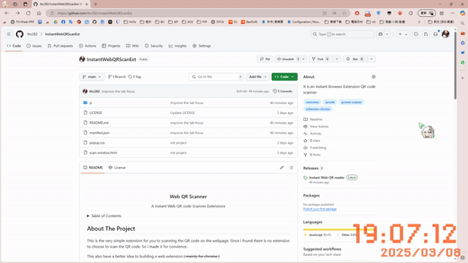
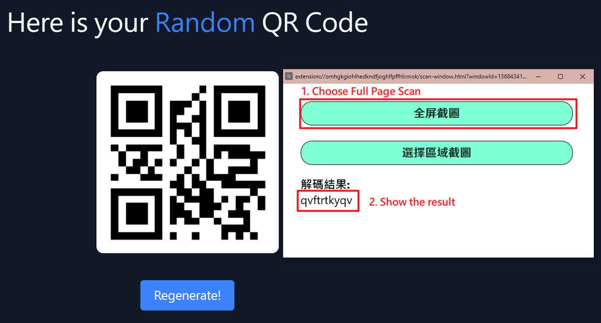
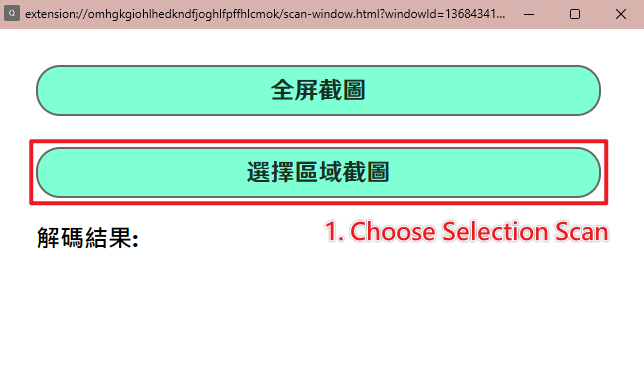
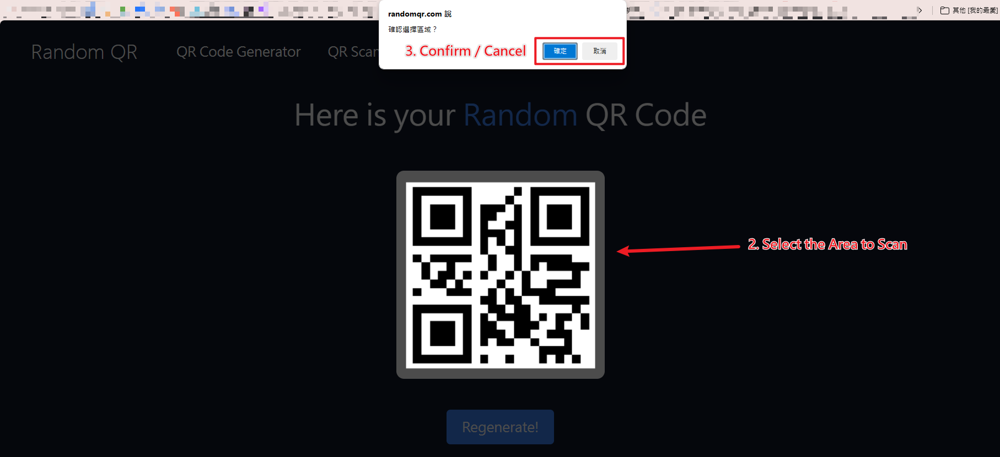
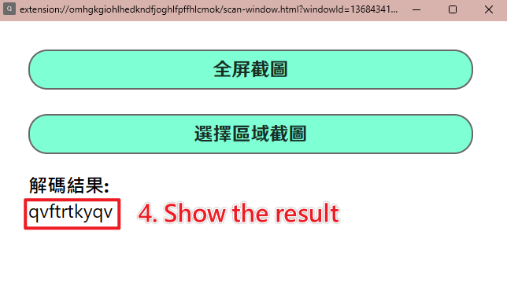

<!-- PROJECT LOGO -->
 

  <!--
  
  -->
  
  <h3 align="center">Web QR Scanner</h3>

  

    A instant Web QR code Scanner Extensions
    <!--
     
    <a href="https://github.com/othneildrew/Best-README-Template"><strong>Explore the docs »</strong></a>
     
     
    <a href="https://github.com/othneildrew/Best-README-Template">View Demo</a>
    &middot;
    <a href="https://github.com/thc282/InstantWebQRScanExt/issues">View Issue</a>
    &middot;
    <a href="https://github.com/othneildrew/Best-README-Template/issues/new?labels=enhancement&template=feature-request---.md">Request Feature</a>
    -->
  

<!-- TABLE OF CONTENTS -->

  
Table of Contents

  <ol>
    <li>
      <a href="#about-the-project">About The Project</a>
      <ul>
        <li><a href="#built-with">Built With</a></li>
      </ul>
    </li>
    <li>
      <a href="#getting-started">Getting Started</a>
      <ul>
        <li><a href="#prerequisites">Prerequisites</a></li>
        <li><a href="#installation">Installation</a></li>
      </ul>
    </li>
    <li><a href="#usage">Usage</a></li>
    <li><a href="#roadmap">Roadmap</a></li>
    <li><a href="#contributing">Contributing</a></li>
    <li><a href="#license">License</a></li>
    <li><a href="#contact">Contact</a></li>
    <li><a href="#acknowledgments">Acknowledgments</a></li>
  </ol>

<!-- ABOUT THE PROJECT -->
## About The Project

This is the very simple extension for you to scanning the QR code on the webpage. Since i found there is no extension to choose to scan the QR code. So i made it for convience.

This also have a better idea to building a web extension ~~( mainly for chrome )~~

(<a href="#readme-top">back to top</a>)

### Built With

The project is build by JavaScript

[![JavaScript][JS-badge]][ECMAScript-url]

(<a href="#readme-top">back to top</a>)

<!-- GETTING STARTED -->
## Getting Started

Here is the instruction to using this extension

### Prerequisites

You dont need any programming knowledge to use it  
But at lease a workable browser

### Installation

Step to installing the extension

1. Download the `ZIP` file in [release][release]
2. Go to browser 3 dot menu -> extension
3. Turn on the developer mode
4. Drag and drop the `ZIP` file into the browser

  
Example

  <table>
    <tr><td align="middle">Edge</td><td></td></tr>
    <tr><td align="middle">Chrome</td><td></td></tr>
  </table>

> I might put in chrome web store in future

(<a href="#readme-top">back to top</a>)

<!-- USAGE EXAMPLES -->
## Usage

> ### Full Page Scanning  

---
> ## Partial Scanning  

(<a href="#readme-top">back to top</a>)

<!-- ROADMAP -->
## Roadmap

- [x] Add Full Page Scan
- [x] Add Selection Scan
- [x] Add Tab focus
- [x] Add Tab Detection

See the [open issues](https://github.com/thc282/InstantWebQRScanExt/issues) for a full list of proposed features (and known issues).

(<a href="#readme-top">back to top</a>)

<!-- CONTRIBUTING -->
## Contributing

Contributions are what make the open source community such an amazing place to learn, inspire, and create. Any contributions you make are **greatly appreciated**.

If you have a suggestion that would make this better, please fork the repo and create a pull request. You can also simply open an issue with the tag "enhancement".
Don't forget to give the project a star! Thanks again!

1. Fork the Project
2. Create your Feature Branch (`git checkout -b feature/AmazingFeature`)
3. Commit your Changes (`git commit -m 'Add some AmazingFeature'`)
4. Push to the Branch (`git push origin feature/AmazingFeature`)
5. Open a Pull Request

### Top contributors:

(<a href="#readme-top">back to top</a>)

<!-- LICENSE -->
## License

Distributed under the **MIT** License. See [LICENSE][License] for more information.

(<a href="#readme-top">back to top</a>)

<!-- CONTACT -->
## Contact

Project Link: [https://github.com/thc282/InstantWebQRScanExt](https://github.com/thc282/InstantWebQRScanExt)

(<a href="#readme-top">back to top</a>)

<!-- ACKNOWLEDGMENTS -->
## Acknowledgments

Credit to. I've included a few of my favorites to kick things off!

* [jsQR](https://github.com/cozmo/jsQR)
* [Img Shields](https://shields.io)

(<a href="#readme-top">back to top</a>)

<!-- MARKDOWN LINKS & IMAGES -->
<!-- https://www.markdownguide.org/basic-syntax/#reference-style-links -->
[JS-badge]: https://img.shields.io/badge/JavaScript-F7DF1E?style=for-the-badge&logo=javascript&logoColor=white&labelColor=000000
[ECMAScript-url]: https://www.ecma-international.org/publications-and-standards/standards/ecma-262/

[License]: https://github.com/thc282/InstantWebQRScanExt/blob/main/LICENSE

[release]: https://github.com/thc282/InstantWebQRScanExt/releases/
